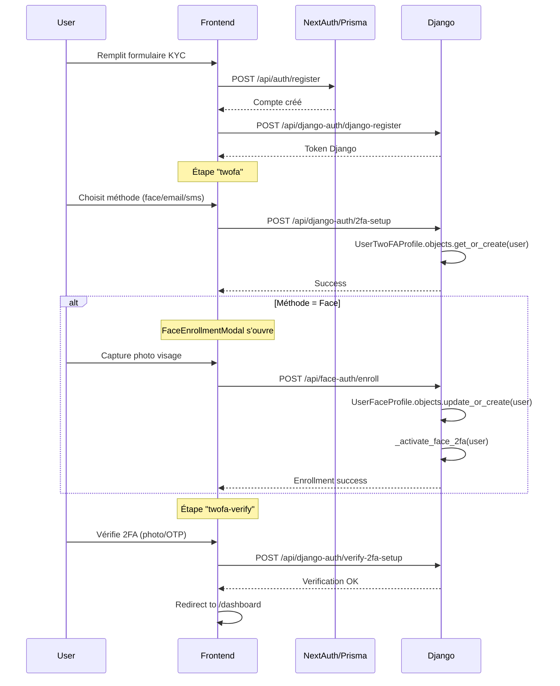

# 🔍 Résolution du Problème Database 2FA

## ✅ Diagnostic Final

Le problème signalé **n'était PAS un bug** mais une situation normale :

### État de la Base de Données
```
✓ Tables créées correctement (face_auth_userfaceprofile, notifications_usertwofaprofile)
✓ Migrations appliquées avec succès
✓ Relations OneToOne fonctionnent parfaitement
✓ 6 profils Face + 8 profils 2FA existants
```

### Utilisateurs Testés
| ID | Username | Face Profile | 2FA Profile | Statut |
|---|---|---|---|---|
| 1-5 | test@example.com, etc. | ✗ | ✗ | **Anciens comptes** créés avant implémentation 2FA |
| 6-13 | amine2fddda@gmail.com, etc. | ✓ | ✓ | **Comptes récents** avec 2FA complet |

### Comment les Profils sont Créés

**1. UserTwoFAProfile** (créé automatiquement lors du setup 2FA)
```python
# backend/notifications/views.py ligne 293
profile, _ = UserTwoFAProfile.objects.get_or_create(user=request.user)
```
Déclenché par: `POST /api/django-auth/2fa-setup` (frontend register page étape "twofa")

**2. UserFaceProfile** (créé lors de l'enrollment Face)
```python
# backend/face_auth/auth_integration.py ligne 57
_, created = UserFaceProfile.objects.update_or_create(
    user=user,
    defaults={"embedding_enc": enc, "is_active": True}
)
```
Déclenché par: `POST /api/face-auth/enroll` (FaceEnrollmentModal component)

### Flow d'Inscription Complet



## 🧪 Test de Validation

### Prérequis
- Django server running on http://127.0.0.1:8000
- Next.js server running on http://localhost:3000
- PostgreSQL database accessible
- FACE_EMBEDDING_KEY configuré dans .env

### Procédure de Test

1. **Nettoyer les anciens comptes** (optionnel)
```bash
cd backend
python cleanup_old_accounts.py
# Taper "oui" pour confirmer
```

2. **Créer un nouveau compte**
- Aller sur http://localhost:3000/register
- Email: `newtest@example.com`
- Mot de passe: minimum 6 caractères
- Uploader une photo de CIN pour KYC
- Confirmer les données extraites
- Cliquer "Create Account"

3. **Configurer 2FA Face**
- Sur l'étape 2FA, choisir **"Face Recognition"**
- Le modal d'enrollment s'ouvre
- Autoriser la webcam
- Capturer votre visage (centré dans l'ovale)
- Attendre "Face enrolled successfully"
- Fermer le modal

4. **Vérifier le setup 2FA**
- L'étape "twofa-verify" s'affiche automatiquement
- Capturer à nouveau votre visage
- Si succès: redirection vers dashboard
- Si échec: vérifier la console Django pour le similarity score

5. **Tester le login 2FA**
- Se déconnecter
- Aller sur http://localhost:3000/login
- Entrer email + password
- Le composant FaceVerifyStep devrait apparaître
- Capturer votre visage
- Si distance < 0.40 → login success

### Vérification Database

Après un nouveau compte créé avec Face 2FA:

```bash
cd backend
python check_relationships.py
```

Attendu:
```
📷 FACE PROFILES: +1 nouveau profil avec has_embedding=True
🔐 2FA PROFILES: +1 nouveau profil avec enabled=True, method=face
👥 USER → PROFILE: user.face_profile ✓, user.twofa_profile ✓
```

## 📁 Scripts de Diagnostic

### check_db.py
Vérifie les tables PostgreSQL et compte les profils

### check_relationships.py  
Teste les relations OneToOne pour chaque utilisateur

### cleanup_old_accounts.py
Supprime les comptes de test créés avant l'implémentation 2FA

## 🔧 Dépannage

### Problème: "Network error during verification"
- ✓ **Résolu**: Timeout étendu à 120s dans TwoFASetupVerification.tsx
- Vérifier que Django répond dans les 120s (check logs)

### Problème: "Face verification failed" 
- Distance threshold par défaut: 0.40 (cosine distance)
- Ajuster FACE_SIMILARITY_THRESHOLD dans .env si besoin
- Vérifier logs Django pour le score exact

### Problème: user.face_profile → RelatedObjectDoesNotExist
- L'utilisateur n'a jamais complété l'enrollment Face
- Normale pour les anciens comptes (1-5)
- Solution: supprimer avec cleanup_old_accounts.py

## ✅ Conclusion

**La database fonctionne correctement.** Les profils 2FA et Face sont créés automatiquement lors du flow d'inscription moderne. Les utilisateurs 1-5 n'ont simplement jamais complété ce flow car ils ont été créés avant son implémentation.

**Action recommandée**: Tester avec un nouveau compte pour valider le flow complet.
