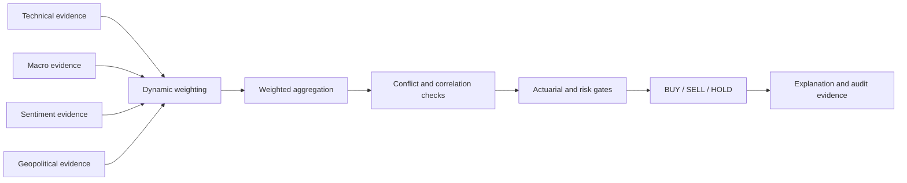
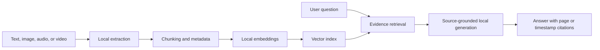

# Trady Platform: Functionalities and Technology

Last reviewed: June 7, 2026

## 1. Platform Overview

Trady is an educational forex research and paper-trading platform focused on
EUR/USD, GBP/USD, USD/JPY, and USD/CHF. It combines market data, deterministic
financial calculations, specialist analysis agents, local AI assistance,
multimodal document search, backtesting, reporting, and account security in one
web application.

The platform does not place trades with a broker. Its signals, analyses,
position sizes, and simulated positions are decision-support and educational
outputs, not financial advice.

## 2. Main User Journey

1. A user creates an account manually or with Google/GitHub OAuth.
2. The user can complete profile, KYC, profile-picture, and security setup.
3. The dashboard reports backend health and available agent history.
4. Live Intelligence loads actual available market candles and lets the user
   request an analysis for a supported currency pair.
5. The Signal Lab combines four specialist agents into an auditable
   BUY/SELL/HOLD decision.
6. Testing lets the user paper-trade and track simulated results.
7. Backtesting evaluates a strategy on historical candles and calculates
   position sizing from market risk.
8. Strategy Tutor answers questions from uploaded text, images, audio, and
   video, subject to the user's subscription.
9. News, Reports, and Monitoring provide supporting market and system views.

## 3. Application Pages

| Route | Module | Purpose | Data status |
|---|---|---|---|
| `/` | Landing page | Introduces Trady, its modules, and team | Static presentation content |
| `/login` | Authentication | Password, OAuth, OTP, and face-login entry points | Operational when providers are configured |
| `/register` | Registration | Account, profile, voice autofill, KYC, picture, and 2FA setup | Operational |
| `/dashboard` | Dashboard | Platform health, agent history, and shortcuts | Backend-driven |
| `/trading` | Live Intelligence | Interactive forex charts and requested market analysis | Backend market data |
| `/agents` | Signal Lab | Four-agent signal generation and evidence inspection | Backend-driven |
| `/testing` | Paper Trading | Manually open, monitor, and close simulated positions | Backend-driven |
| `/news` | Market News | Search and filter classified financial headlines | Stored collected news |
| `/reports` | Signal Reports | Signal outcomes, KPIs, performance curve, and CSV export | Backend history |
| `/strategy-tutor` | Strategy Tutor | Multimodal local RAG chat with cited sources | User-uploaded knowledge |
| `/backtesting` | Backtesting | Historical strategy evaluation and position sizing | Backend market data |
| `/monitoring` | Monitoring | Validation and model-monitoring interface | Currently demo/static values |
| `/billing` | Plans and Billing | Plan comparison and Stripe Checkout | Operational in Stripe test/live mode |
| `/features` | Feature Lab | Technical feature-engineering reference | Internal/reference view |

## 4. Authentication and Registration

### Account creation

- Email/password registration.
- Password hashing with bcrypt.
- Google OAuth and GitHub OAuth through NextAuth when credentials are present.
- Automatic creation of a Trady Basic subscription for new users.
- Duplicate-account and input validation.

### Extended profile

The user profile can store:

- Display name and legal name.
- Email and phone number.
- Country, city, and address.
- Profession.
- Trading experience and preferred market.
- Short biography.
- Profile picture.

The profile picture is uploaded manually, is limited to 5 MB, and is displayed
in the authenticated application sidebar.

### Voice profile autofill

Registration includes a voice-recording interface. The user can speak a profile
paragraph, review the transcript, inspect detected fields, and choose whether
to apply them to the form.

The local pipeline:

1. Records audio in the browser.
2. Sends it to the registration transcription endpoint.
3. Transcribes it locally with faster-whisper.
4. Normalizes spoken email addresses, phone numbers, dates, and identity terms.
5. Extracts profile and optional identity-document fields.
6. Leaves the fields editable before submission.

The password is never inferred or filled from voice.

### KYC and identity fields

The registration flow supports:

- Identity-document image upload.
- OCR-assisted extraction.
- Full legal name.
- Document number.
- Nationality and issuing country.
- Document type.
- Date of birth and expiration date.
- OCR confidence, raw OCR text, and verification status.
- Manual review and correction before submission.

### Two-factor authentication

The registration/security step offers:

- Skip for now.
- Email one-time password.
- SMS one-time password when Twilio is configured.
- Face authentication through the camera.

## 5. Dashboard

The dashboard loads the backend health response and summarizes:

- Platform operational status.
- Number of agents represented in stored performance data.
- Total historical signals.
- Average historical win rate when outcomes exist.
- Per-agent signal count, win rate, Sharpe ratio, and maximum drawdown.
- Shortcuts to signal generation, monitoring, testing, and other modules.

Performance values depend on recorded outcomes. Empty histories should produce
empty or zero states rather than invented performance.

## 6. Live Market Intelligence

Live Intelligence is the chart-and-advice workspace.

### Market chart

- Supports EUR/USD, GBP/USD, USD/JPY, and USD/CHF according to plan access.
- Supports 1-hour, 4-hour, and daily analysis horizons.
- Renders actual available OHLC candles with TradingView Lightweight Charts.
- Displays volume, EMA 21, and EMA 55.
- Shows the market-data source, timestamp, and freshness state.
- Distinguishes live, delayed, stale, market-closed, and unavailable data.
- Does not fabricate candles, prices, or spreads when a feed is unavailable.

Market quotes can come from a connected local MetaTrader 5 terminal and stored
OHLC history. The stored dataset is used when a live terminal is unavailable.

### Requested intelligence

The user explicitly requests analysis. The backend then:

- Calculates technical features from the selected pair and timeframe.
- Collects macro, news-sentiment, and geopolitical evidence.
- Runs the four specialist agents.
- Detects disagreement and evidence gaps.
- Computes support, resistance, ATR-based stop, and target suggestions.
- Returns BUY, SELL, or HOLD with confidence and supporting evidence.
- Can force HOLD when evidence coverage or risk checks are insufficient.

### Validated machine-learning model

The analysis pipeline can train a local histogram gradient-boosting classifier
on available historical features. It uses chronological train/holdout
separation and compares held-out balanced accuracy against a majority-class
baseline. Its output is excluded when validation does not beat the required
baseline threshold.

### Chart capture

- The visible chart can be downloaded as a PNG.
- The capture can optionally be inspected by a local Ollama vision model.
- Vision describes visible chart structure only and cannot change the numeric
  trading decision.
- The application stores an audit hash rather than retaining the screenshot.

### Paper-position link

A paper position can be created only from an approved, user-owned analysis.
The backend obtains the current market price itself and does not trust a price
submitted by the browser.

## 7. Signal Lab and Multi-Agent Architecture

### Specialist agents

#### Technical Agent

Analyzes actual OHLC history across multiple timeframes. Its inputs include
trend, momentum, volatility, and volume features such as moving averages, RSI,
MACD, Bollinger Bands, ATR, and ADX.

#### Macro Agent

Builds a directional currency bias from available macroeconomic evidence,
including interest-rate differentials, inflation differences, rate momentum,
carry conditions, and relevant central-bank information.

#### Sentiment Agent

Scores recent currency-relevant financial news with relevance, recency, and
time decay. The implemented agent should not be described as using social media
or COT data unless those sources are actually connected.

#### Geopolitical Agent

Examines stored global headlines for risk-on/risk-off conditions and potential
safe-haven currency effects.

### Coordination

LangGraph runs the deterministic coordination workflow:

Default voting weights are Technical 35%, Macro 25%, Sentiment 20%, and
Geopolitical 20%. They can be adjusted using evidence quality, market regime,
freshness, and available historical performance.

The deterministic numeric layers establish direction and risk. A local
language model may explain or review the result, but it is not trusted to
invent prices, indicators, or evidence. The risk manager has the final veto.

### Signal output

A generated result can contain:

- Direction and confidence.
- Individual agent scores and rationales.
- Applied dynamic weights.
- Evidence coverage and freshness.
- Agent conflicts.
- Cross-pair correlation warnings.
- Expected value, estimated probability, reward/risk, and Kelly sizing basis.
- Risk approval or rejection.
- Suggested execution plan.
- Human-readable explanation.

## 8. Testing and Paper Trading

Testing is a separate simulation module. It does not execute broker orders.

Users can:

- Select a supported pair and BUY or SELL direction.
- Choose a timeframe and position size.
- Use a current market entry or enter a manual test price.
- Save rationale and notes.
- Open and close simulated positions.
- Review open and closed trades.
- Track current, realized, and unrealized P&L.
- Review win rate and average realized P&L when closed outcomes exist.
- Preserve an agent snapshot with the test decision when available.

## 9. Backtesting and Position Sizing

### Backtesting

The page calls the backend with a selected pair and historical lookback of 200,
500, 1,000, or 1,500 bars. Results are calculated from loaded market candles,
not frontend placeholder values.

The result includes:

- Total return.
- Win rate.
- Sharpe ratio.
- Maximum drawdown.
- Total, winning, and losing trades.
- Profit factor.
- Average win and average loss.
- Equity curve.
- Individual simulated trade records when available.

Backtests describe historical behavior and do not guarantee future performance.
Available history and the user's plan limit the usable period.

### Position sizing

The position-sizing endpoint combines:

- User-entered capital.
- Selected currency pair.
- User-entered model confidence.
- Current market volatility and ATR from backend data.
- Risk constraints.

It returns a calculated position-size recommendation and related risk values.
It does not place the position automatically.

## 10. Multimodal Strategy Tutor

The Strategy Tutor is a local retrieval-augmented generation system. It answers
from the user's uploaded knowledge base and cites the evidence used.

### Supported files

| Modality | Extensions | Maximum size |
|---|---|---:|
| Text | PDF, TXT, MD | 10 MB |
| Image | PNG, JPG, JPEG, WEBP, BMP | 15 MB |
| Audio | MP3, WAV, M4A, FLAC, OGG | 50 MB |
| Video | MP4, MOV, MKV, WEBM, AVI | 250 MB |

### Ingestion

- PDFs are extracted with page references.
- Images use EasyOCR/OpenCV/Pillow and can use a local Ollama vision fallback.
- Audio is transcribed locally with faster-whisper into timestamped segments.
- Video audio is extracted locally with FFmpeg and transcribed.
- Video frames are sampled every 30 seconds, up to 20 frames, then processed
  with the image OCR/vision path.
- Video evidence records whether it came from an audio transcript or a sampled
  frame.
- Extracted text is chunked, embedded, and indexed for retrieval.

### Retrieval and answers

- Embeddings use local Ollama `nomic-embed-text`, with a local
  sentence-transformer fallback.
- Vector retrieval uses FAISS and stored chunk metadata.
- Answer generation uses a local Ollama chat model.
- Responses stream to the browser through server-sent events.
- Citations identify filename, modality, page, and/or timestamp.
- The tutor can copy, regenerate, or clear responses.
- An unrelated question should be refused when the uploaded evidence does not
  cover it.
- Uploaded documents can be listed and deleted.

No paid hosted model is required for the tutor.

## 11. Market News

The News module:

- Displays collected financial headlines.
- Classifies each item as positive, neutral, or negative from its stored
  sentiment score.
- Shows classification counts.
- Filters by classification.
- Searches headline, source, and available content.
- Shows publication time and related currencies when present.
- Links to the original article.
- Can request a feed refresh.

Collection depends on configured feeds, network access, API quotas, and
background jobs. An empty view means no recent stored items matched the filter;
the frontend must not generate synthetic headlines.

## 12. Signal Reports

Reports are generated from backend signal/outcome history for the selected pair
and 90-day window.

They include:

- Total recorded P&L.
- Win rate.
- Number of signals.
- Sharpe ratio.
- Confluence score.
- Cumulative P&L curve.
- Signal direction, confidence, agent name, outcome, timestamp, and P&L.
- Pair filtering.
- CSV export.

When no outcome history exists, the page returns an empty state or zero-valued
summary rather than sample trades.

## 13. Monitoring and Validation

The Monitoring interface contains views for:

- Missing-value checks.
- Outlier checks.
- Timestamp consistency.
- OHLC validation.
- Collection-rate and latency presentation.
- Inference/pipeline latency charts.
- Population Stability Index drift.
- Model-run history.

**Current implementation status:** the values on this page are presently
hard-coded/demo data, including randomized latency and drift series and fixed
historical runs. They must not be presented as real operational measurements.
To make the module production-valid, these cards and charts need to be wired to
stored validation runs, service telemetry, and model experiment records.

## 14. Plans and Access Control

Feature availability is enforced in the UI and relevant API routes.

| Capability | Trady Basic | Trady Plus | Trady Pro |
|---|---:|---:|---:|
| Monthly signal generations | 2 | 100 | 500 |
| Currency pairs | EUR/USD, GBP/USD | All 4 pairs | All 4 pairs |
| Strategy Tutor | Closed | Enabled | Enabled |
| Tutor documents | 0 | 20 | 100 |
| Tutor modalities | None | Text, image, audio | Text, image, audio, video |
| Backtesting history | Closed | Up to 30 days | Up to 365 days |
| Advanced agent access | No | No | Yes |
| Priority local processing | No | No | Yes |

Commercial prices displayed by the application:

- Trady Basic: free.
- Trady Plus: 29 TND/month or 290 TND/year.
- Trady Pro: 69 TND/month or 690 TND/year.

Stripe Checkout handles paid subscription payment. The current checkout
configuration charges configured EUR amounts corresponding to the commercial
plans. Webhook/completion logic updates the stored subscription after a
successful checkout. Secret Stripe credentials remain server-side.

## 15. Billing

The billing page:

- Displays Basic, Plus, and Pro plan artwork.
- Shows current plan and available upgrades.
- Explains included features and limits.
- Starts Stripe Checkout for monthly or annual billing.
- Returns the user to a success or cancellation state.
- Stores customer, subscription, plan, billing interval, status, and renewal
  information.
- Tracks plan usage such as signal generation.

## 16. Theme, Accessibility, and Navigation

- Collapsible left navigation.
- User profile and plan badge in the sidebar.
- Dark and light application themes.
- The public landing page is intentionally forced to dark mode.
- Compact icon controls for theme, accessibility, and billing.
- Responsive layouts for desktop and smaller screens.

Accessibility controls include:

- Font scaling.
- High-contrast mode.
- Color-vision filters.
- Line-spacing controls.
- Larger cursor.
- Reduced motion.
- Dyslexia-friendly font option.
- Link highlighting.
- Page reading/text-to-speech assistance.

## 17. AI Copilot

The floating AI Copilot provides a contextual in-app assistant for chat,
navigation, and supported page actions. It is intended to help users operate
the application; it does not bypass authentication, subscription controls,
backend validation, or trading risk gates.

## 18. Data and Audit Storage

### PostgreSQL

Stores relational application data such as:

- Users and profiles.
- Password/OAuth account information.
- KYC records.
- Subscriptions and usage.
- Paper positions.
- User market analyses.
- Signal, news, macro, and fallback OHLC records managed by the backend.

### InfluxDB

Stores time-series market data where configured, with PostgreSQL OHLC storage
available as a fallback.

### Redis

Supports caching, asynchronous tasks, Django Channels, and transient
coordination.

### Analysis audit record

Market analyses can store:

- User, pair, timeframe, and horizon.
- Action and confidence.
- Market timestamp, source, status, and latest price.
- Full structured result JSON.
- Optional screenshot hash.
- Creation timestamp and linked paper position.

## 19. Background Processing

Background services can:

- Refresh OHLC market history.
- Collect financial news.
- Refresh macroeconomic data.
- Classify and store news sentiment.
- Run scheduled maintenance and ingestion.
- Process longer-running tasks through Celery/Redis.

External data availability depends on locally configured sources and keys.
Potential integrations in the codebase include MetaTrader 5, financial/macro
feeds, NewsAPI/RSS-style feeds, and public market-data libraries.

## 20. Technology Stack

### Frontend

| Technology | Use |
|---|---|
| Next.js 16 | React application, routing, server routes, and API proxying |
| React 19 + TypeScript | Component UI and type-safe application logic |
| Tailwind CSS 4 | Styling and responsive themes |
| shadcn/Radix UI patterns | Accessible reusable UI primitives |
| Lucide React | Interface icons |
| Framer Motion / Motion | Controlled UI animation |
| TradingView Lightweight Charts | Interactive candlestick and indicator charts |
| Recharts | Reports, backtesting, and monitoring charts |
| NextAuth | Credentials, Google, and GitHub authentication |
| Prisma | User, profile, subscription, KYC, and position data access |
| TanStack React Query | Client data fetching/caching where used |
| Zod | Request and form validation |
| Page Agent | Contextual application copilot layer |

### Backend

| Technology | Use |
|---|---|
| Django 5 | Main backend application |
| Django REST Framework | JSON APIs |
| Django Channels + Daphne | WebSocket/asynchronous support |
| Celery + Redis | Background jobs |
| APScheduler | Scheduled refresh work |
| PostgreSQL | Relational persistence |
| InfluxDB | Time-series market data |
| LangChain | Local model and retrieval integrations |
| LangGraph | Multi-step agent coordination |
| Ollama | Local chat, embedding, and optional vision models |
| PyTorch / Transformers | Local machine-learning and NLP components |
| scikit-learn | Validated classifiers and numeric ML utilities |
| pandas / NumPy / SciPy / `ta` | Market-data processing and indicators |
| FAISS | Local vector similarity search |
| sentence-transformers | Local embedding fallback |
| faster-whisper | Local speech transcription |
| EasyOCR / OpenCV / Pillow | Image and document vision processing |
| pypdf | PDF text extraction |
| imageio-ffmpeg | Local video audio/frame processing |
| facenet-pytorch / DeepFace | Face-authentication support |
| Twilio | Optional SMS OTP delivery |

### Infrastructure

- Docker Compose provisions PostgreSQL 15, InfluxDB 2.7, and Redis 7.
- The Next.js frontend normally runs on port 3000.
- The Django API normally runs on port 8000.
- PostgreSQL normally runs on port 5432.
- InfluxDB normally runs on port 8086.
- Redis normally runs on port 6379.
- Ollama runs locally on the host and serves downloaded open models.

## 21. Security and Privacy

- Passwords are hashed rather than stored as plaintext.
- OAuth secrets, Stripe secrets, and provider credentials belong in
  environment variables.
- Protected APIs require authentication.
- User analyses, positions, documents, and subscription state are scoped to
  the authenticated account.
- Plan limits are checked server-side for sensitive operations.
- Voice transcription, document extraction, embeddings, RAG generation, and
  optional screenshot vision can run locally.
- Uploaded knowledge is not intentionally sent to a paid hosted AI provider.
- Paper positions are validated by the backend using server-fetched prices.
- Screenshot analysis retains a hash for audit rather than the image itself.

Any credentials previously exposed in chat, screenshots, source control, or
logs should be revoked and replaced.

## 22. Accuracy and Product Boundaries

- Trady is an educational research and simulation platform.
- It does not guarantee profitable signals.
- It does not execute live broker trades.
- Market-data status must be shown to the user; stale data must not look live.
- A local LLM explains evidence but should not create numeric market facts.
- Machine-learning influence is conditional on held-out validation.
- Missing evidence and strong agent conflict can produce HOLD or rejection.
- Historical backtests are not forecasts.
- Signal performance is meaningful only after enough real outcomes are stored.
- The current Monitoring page is a demonstration and is not yet a source of
  real telemetry.
- Optional OAuth, SMS, market, news, macro, and Stripe functionality requires
  correct environment configuration.

## 23. Short Technical Summary

Trady uses a Next.js/React interface and a Django analytical backend. PostgreSQL
stores application records, InfluxDB handles market time series, Redis supports
tasks and asynchronous features, LangGraph coordinates specialist agents, and
Ollama provides local language, embedding, and vision capabilities. Numeric
trading decisions are grounded in stored market data and deterministic risk
logic, while local AI is used for explanation, document understanding, speech,
and contextual assistance.
